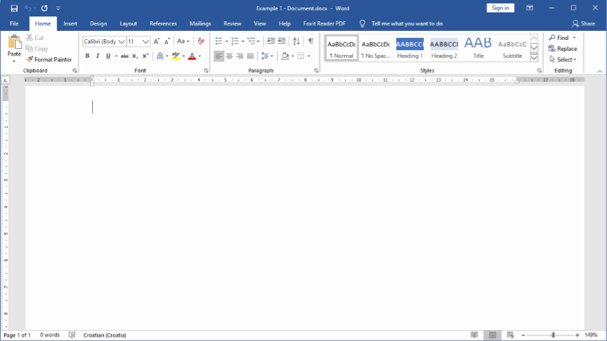

  <h1>
    Lemonote
    
  </h1>

Lemonote helps you copy/paste notes in any application and generate GDS commands through user-friendly dialogs.

  

## Table of Contents

- [About](#about)
- [Installation](#installation)
- [How it works](#howItWorks)
- [Usage](#usage)
- [Requirements](#requirements)
- [Built Using](#builtUsing)
- [Acknowledgments](#acknowledgments)
- [FAQ](#faq)
- [Development](#development)

## About 

> When aviation gives you lemons, note it! :wink:

It's a lightweight hotkey tool that sits in your tray and waits for actions. Paste your notes in emails/documents or generate GDS commands for online/offline Amadeus and Sabre.

The project started as a fun idea, with **Sanja Boskovic Kajic** ([Boutique Travel](https://www.facebook.com/travelsanjaboskovickajic)), to create helper tool for travel agents. Goal was to have a minimal interface, simple interaction and steep (fast) learning curve. A travel agent or not, business or home user, you are welcome to use it.

## Installation 

  <h4 align="center">
    <a href="https://github.com/mmustra/lemonote/releases/download/v1.0.0/Lemonote-1.0.0-setup.exe" rel="noopener">DOWNLOAD INSTALLER</a>
  </h4>

Lemonote can be downloaded as an installer or portable software. Always use versions provided ONLY from this site. If your antivirus detects Lemonote installer or application as a threat, it is false-positive. For more information regarding security and privacy check [FAQ](#faq) section.

- **Installer version** is recommended for everyday use on your workstation. It will give you a shortcut on the desktop, folder in Start menu, run with Windows startup and hold your notes in your Documents folder.
- **Portable version** is more convenient when you want to carry Lemonote on a USB stick and use it on any other computer without installing it. Bear in mind that the "Notes" folder will be within the executable folder. <a href="https://github.com/mmustra/lemonote/releases/download/v1.0.0/Lemonote-1.0.0-portable.zip" rel="noopener">Download portable</a>

**NOTE:**  
If you are updating to the new version, be sure to exit/close Lemonote before new installation. Also, you don't need to uninstall the old version, just run a new installer.

## How it works 

Lemonote uses <a href="https://www.autohotkey.com/docs/commands/Hotkey.htm" rel="noopener">hotkeys</a> and <a href="https://www.autohotkey.com/docs/Hotstrings.htm" rel="noopener">hotstrings</a> to run scripted actions. You run action by typing it in editor/program or with key combinations. Output of action will be shown back in editor/program from which command was summoned, presuming that editor/program is not closed or minimized.

There are three types of actions:

1. **Notes actions**  
   Will output your custom notes that can be in rich or plain text format. Define your signatures, policies, snippets and use them with any software (MS Office, Web browser, Messenger...).
2. **GDS actions**  
   Will show SSR APIS and Contact dialogs to generate GDS command as output. Get your GDS commands from a more user-friendly interface, with validation, and don't worry about command format ever again. You can use these actions with offline/online GDS systems or with document editors.
3. **Helper actions**  
   Will help you with the everyday work routine.

## Usage 

Once Lemonote is running it will show in your tray (yellow lemon icon). By right-clicking on it you will get a list of options to choose from:

- **Reload Lemonote** - Reloads application and sets hotstrings for notes.
- **Suspend Hotkeys** - Disables all hotkeys and hotstrings.
- **Change GDS** - Activate different GDS modules and their actions.
- **Notes** - Opens the folder where you'll keep all your notes.
- **Help** - Opens quick help file.
- **Exit** - Exits application.

#### Notes Actions

All notes need to be stored as [valid type](#validNoteTypes) documents in "Notes" folder. If you want to have rich text format notes, you need to have MS Word 2007+ installed, otherwise use plain notes. To activate Notes action, start by typing `:` followed by `filename` text (case insensitive) and ending it by hitting key <kbd>ENTER</kbd>. For instance, if you created filename called "mysig.docx" in "Notes" folder, to paste its contents somewhere, you will have to type:

> **:mysig**<kbd>ENTER</kbd>

You can have subfolders inside the "Notes" folder to better organize your notes. If across all folders/subfolders you create more files with the same name (case insensitive),
only one will be active (parent folder takes precedence; with sibling folders alphabetical order takes precedence). The first time you install Lemonote, example notes will be provided to give you a sense of what can be done. Try them out.

When adding a new note:

1. Open the "Notes" folder (right-click on the Lemonote icon, then click "Notes").
2. Create new document file (.txt, .doc, .docx, ...) file with your content. Save file.
3. Reload Lemonote (double-click the Lemonote icon in the tray or right-click on the Lemonote icon in the tray, then click "Reload Lemonote") to activate hotstring.

Valid file types: 

- **Rich Format** - .doc, .docm, .docx, .dot, .dotm, .dotx, .htm, .html, .mht, .mhtml, .odt, .rtf, .wps, .xml, .xps
- **Plain Format** - .txt

#### GDS Actions

To activate GDS action, start by typing `::` followed by `command` text and ending it by hitting key <kbd>ENTER</kbd>. For example, if you want to generate APIS "docs" command you will have to type:

> **::docs**<kbd>ENTER</kbd>

If you find commands hard to remember, use `::list` or depending on your GDS choice `::amdeus` / `::sabre` command to show you quick commands list.

> **::list**<kbd>ENTER</kbd>

Depending on GDS there may be a different set of actions.

| Amadeus ([beta](#userContribution)) | Description                           |
| ----------------------------------- | ------------------------------------- |
| ::list <kbd>or</kbd> ::amadeus      | Quick commands list                   |
| ::docs                              | SSR Passport information dialog       |
| ::doco                              | SSR Visa information dialog           |
| ::doca                              | SSR Destination information dialog    |
| ::pctc                              | Phone contact dialog                  |
| ::ctce                              | Email contact dialog                  |
| ::ctcm                              | Mobile contact dialog (short version) |

| Sabre                        | Description                           |
| ---------------------------- | ------------------------------------- |
| ::list <kbd>or</kbd> ::sabre | Quick commands list                   |
| ::docs                       | SSR Passport information dialog       |
| ::doco                       | SSR Visa information dialog           |
| ::doca                       | SSR Destination information dialog    |
| ::pctc                       | Phone contact dialog                  |
| ::ctce                       | Email contact dialog                  |
| ::pctm                       | Mobile contact dialog (long version)  |
| ::ctcm                       | Mobile contact dialog (short version) |
| ::ctcr                       | Refusal contact dialog                |

#### Utility Actions

These actions are meant to give you help in everyday workflow and will be expanded with more if needed.

| Command                                | Description                                 |
| -------------------------------------- | ------------------------------------------- |
| <kbd>CTRL</kbd> + <kbd>SHIFT</kbd> + v | Paste rich format text to plain format text |

## Requirements 

- Windows 7+
- MS Office 2007+ (Word)

## Built Using 

- [AutoHotkey](https://www.autohotkey.com) - Scripting language used for development
- [Inno Setup](http://www.jrsoftware.org/isinfo.php) - Installer for Windows

## Acknowledgments 

Special thanks to **Sanja Boskovic Kajic** ([Boutique Travel](https://www.facebook.com/travelsanjaboskovickajic)). She sparked the idea which motivated the development of the Lemonote application. Thanks to her advices regarding the travel agent's work-flow and most of the testing, we were able to create needed features and behavior.

Hornable mentions:

- **Alguimist** - [AutoGUI](https://sourceforge.net/projects/autogui), application used for composing GUI dialogs.
- **[AHK-just-me](https://github.com/AHK-just-me)** - [CtlColors](https://github.com/AHK-just-me/Class_CtlColors), library used for controling GUI colors.
- **Verdlin** - [EasyIni](https://www.autohotkey.com/boards/viewtopic.php?f=6&t=5522), library used to mange ini files.
- **[XhmikosR](https://github.com/XhmikosR)** - [PSVince](https://github.com/XhmikosR/psvince), library used for in memory module detection.
- **[Etherbrian](http://www.iconarchive.com/artist/etherbrian.html)** - Designer of "lemon" icon.
- **[Mihaiciuc Bogdan](http://www.iconarchive.com/artist/bogo-d.html)** - Designer of "stop"icon.
- **[Greenfish](http://greenfishsoftware.org/gfie.php)** - Icon editor used for icon composition.
- **[Resource Hacker](http://www.angusj.com/resourcehacker)** - Resource editor used for packing icons.
- **[FreeLogoDesign](https://www.freelogodesign.org)** - Logo provider used in examples.
- **[Mail Signatures](https://www.mail-signatures.com/signature-generator)** - Signature provider used in examples.
- **[IATA](https://www.iata.org)** - Baggage note information used in examples.
- **[Various Contributors](https://www.autohotkey.com/boards)** - Utility functions, AHK extra info.
- All the testers from various fields.

## FAQ 

#### General

- **Can I use Lemonote professionally in my company?**  
  Yes. You are free to use Lemonote in your company or home as you wish. Lemonote is released under [MIT](./LICENSE) license.
- **Is Lemonote safe?**  
  Yes. If your Antivirus reports Lemonote as a threat, it is false-positive.
- **Does Lemonote require an Internet connection?**  
  No. Lemonote doesn't require an Internet connection to work. It will not connect to any servers even if the internet connection is available.
- **Does Lemonote communicate with my GDS?**  
  No. There isn't any kind of communication between Lemonote and your GDS. After you use an action to generate the GDS command, Lemonote will not send it. The user is responsible for sending a command.
- **Does Lemonote record my GDS commands?**  
  No. Once the GDS command is outputted, it will not be saved or reused again.
- **I've seen Lemonote on other web sites, is it ok to download it from there?**  
  No. You should download Lemonote ONLY from this site. Other sites may provide a compromised version.
- **Will Lemonote work when I reinstall/change or use an online version of my GDS platform?**  
  Yes. Lemonote doesn't care about your GDS version if it's desktop or web application. As long the GDS/browser window is not minimized or closed it should output the GDS command.
- **Does Lemonote prefer one GDS over the other?**  
  No. Sabre is better supported as it was the main feature starting this project. At the moment Amadeus is in beta, but with more user input it will be polished. Depending on interest Lemonote may extend its support to Galileo and other systems.

#### Problems

- **I've added my files in the "Notes" folder, but after entering hotstring ":filename<kbd>ENTER</kbd>" command in my editor, Lemonote does nothing. Is this a bug?**  
  No. After you add new files, you need to reload Lemonote for new hotstrings to be active. You can reload Lemonote by double-clicking the icon in the tray or by right-clicking on the icon in the tray and choosing "Reload Lemonote". Also be sure to check if you have duplicate files in the "Notes" folder, as only one will be active (parent folder takes precedence; with sibling folders alphabetical order takes precedence).
- **Lemonote is throwing the "MS Word missing" error. Is this a bug?**  
  No. If you want to use rich text format notes (.doc/.docx files), you are required to have MS Word 2007+ installed. You can use plain format notes (.txt files) instead though.
- **Lemonote is throwing an "Invalid note file" error. Is this a bug?**  
  No. Your notes need to be saved in a [valid type](#validNoteTypes) format.
- **Lemonote is throwing the "Program window inactive" error. Is this a bug?**  
  No. Your editor/program, from where you typed action, is either minimized or closed.
- **Lemonote is sometimes slow, showing "Initializing..." or "Getting note..." tooltip while getting a note. Is this a bug?**  
  No. Depending on the size of your note, and if a note is in rich or plain text format, load time can vary. Lemonote will always try its best to get your notes asap.
- **Lemonote installation is throwing warning message "Before reinstalling Lemonote close the running instance...". Is this a bug?**  
  No. Lemonote needs to be closed before fresh install/reinstall due to its cleanup routine.

## Development 

The project was created closely collaborating with users every step of the way, evaluating requests/problems/opinions regarding all features. Although requirements are met and the main features implemented, in the future there may be changes to current behavior.

Check out the progress here:

- [Feature List](./resources/readme/FEATURES.md)
- [Projects](https://github.com/mmustra/lemonote/projects)
- [Changelog](./resources/readme/CHANGELOG.md)

#### I'm a developer, can I help?

Awesome, we share the same passion! You can [contribute](./resources/readme/CONTRIBUTING.md) by fixing bugs and implementing new features.

#### I'm a user, can I help? 

Hi. You are perfect (beta) tester! :smile: Play around with the application and track down the bugs. If you are in the travel/aviation business, I'll appreciate it if you check the GDS commands that are generated and report if there are some irregularities. Whether you want to contribute by reporting problems, requests or even if you just want to say thanks, feel free to [email](mailto:marin.mustra@gmail.com) me.

## License

The MIT License ([MIT](./LICENSE))  
Copyright (c) 2020-present, Marin Muštra
